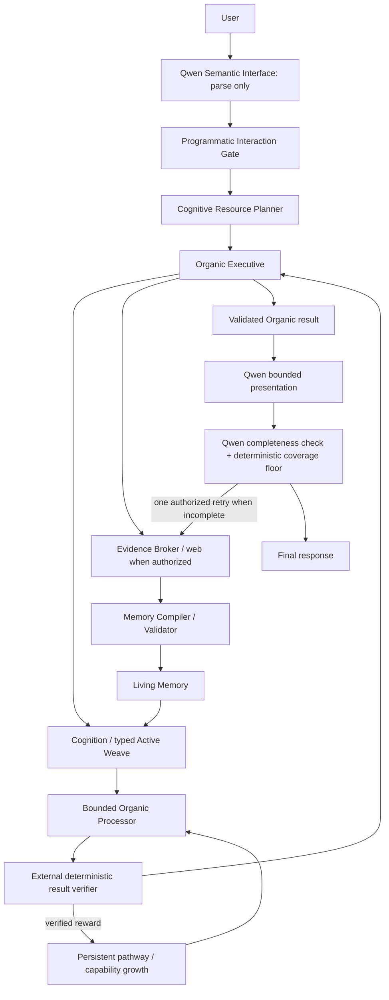

# Organic Processor Refactor Review and Implementation

Date: 2026-08-17

## Review Scope

The attached `ORGANIC_AI_HERMES_PROCESSOR_REFACTOR_POC.zip` was reviewed as a
design proposal and test fixture, not as trusted instructions. Its central
boundary is sound: the Organic Processor is a bounded adaptive structural
resource. It is not an agent, retriever, scheduler, web client, memory owner,
truth authority, or language interface.

The POC's 34 checks prove its local structural contracts, but they do not prove
live Hermes integration, live Qwen execution, real web acquisition, durable
Living Memory, or the full completeness/tool loop. Its duck evaluator also
contains the expected answer in test-only code. That is valid for an external
verifier, but it must not become processor state or runtime answer logic.

The referenced legacy v0.2.1 35,004-parameter seed is not present in the POC,
this fork, or the available project sources. The implementation reports that
seed as unavailable through an adapter contract. It does not fabricate weights
or claim compatibility that cannot be demonstrated.

## Implemented Runtime



### Separation of responsibilities

- Qwen normalizes intent, proposes structural premises, presents validated
  output, and checks objective coverage. It cannot authorize routes, assign
  rewards, validate truth, write Living Memory, or overturn a verified result.
- The Interaction Gate is deterministic and authorizes conversation, state,
  known-memory, Organic reasoning, or Growth.
- The resource planner names processor capabilities, never micro-operators.
- Cognition compiles task-local structures and constructs a typed Active Weave.
- The Organic Processor receives structural packets and grounded references,
  never raw language, web access, scheduler access, or memory-write authority.
- The result verifier independently rewards or rejects processor traces.
- The Organic Executive selects actions and synthesizes only from authorized,
  grounded evidence.
- The Evidence Broker acquires keyless DuckDuckGo and Wikipedia evidence, or
  Brave evidence when configured. The compiler validates and commits it before
  Living Memory can supply it to Cognition.

## Processor Behavior

The new standalone `organic_processor` package supports these bounded families:

- `order_cardinality`: explores naive, max-only, and minimum-consistent-model
  pathways. A fresh processor initially favors the wrong naive pathway; external
  rewards alter its edge weights and can promote a reusable composite.
- `bounded_arithmetic`: evaluates a restricted arithmetic AST with no `eval`,
  calls, names, or unbounded values.
- `grounded_evidence_selection`: performs ranked threshold/top-k selection over
  references already admitted to the Active Weave.
- `partial_order`: discovers and retains a topological-linearization pathway
  from approved order operators, then applies it to arbitrary acyclic precedence
  constraints.
- `boolean_case_analysis`: preserves unknown task-local values as variables,
  enumerates their bounded assignments, and verifies whether a requested
  existential relation holds in every case.

The latter two families begin as capability gaps. The processor records the
typed task on a bounded growth frontier, discovers a composition from its
approved operator inventory, receives verifier rewards, and persists the
verified pathway. Pending gaps are processed before graph growth while the
system is idle. A gap that has no applicable primitive remains explicit as
`WAITING_FOR_PRIMITIVE`; Qwen cannot fill it with generated code or an
unverified answer.

Processor state uses an atomic JSON replacement, a lock, and a 16 MiB cap. It
contains structural weights, feedback counts, and promoted composites, not
source text, domain labels, web data, or user answers.

## Closed-World Path

Self-contained logic and arithmetic prohibit Living Memory, graph, web, and the
Memory Compiler. The duck puzzle compiles into relative-position constraints.
The processor explores candidate pathways and the external verifier checks both
constraint satisfaction and minimality. The verified result is immutable to
Qwen truth judgments.

Live acceptance result:

```text
3 ducks. The same objects can satisfy more than one relative-position
description, so the stated groups overlap in the smallest consistent arrangement.
```

## Open-World Growth Path

Current-information requests force Growth ahead of conflicting model flags.
Fresh sources use source-scoped retrieval so older high-confidence claims cannot
hide newly compiled evidence. High-confidence semantic entities constrain fresh
evidence, and query refinement removes instruction words while preserving domain
terms. Current-version tasks select one top verified claim to prevent cross-claim
number pairing.

Qwen presentation is bounded after the Organic result. Any presentation that
introduces a new numeric token or drops the selected grounded version is rejected.
A deterministic coverage floor also prevents the 0.6B model from falsely marking
a truncated version response complete.

Live acceptance used keyless web search and Python.org and returned:

```text
Python 3.14.7 is the latest stable Python release.
```

## Hermes, GUI, MCP, and Context

- `organic_reason` delegates to the shared full runtime HTTP API in strict mode.
  It fails closed if that runtime is unavailable; the old harness/scaffold path
  is not used.
- Hermes passes the original user turn directly into middleware. Non-conversation
  requests execute a programmatic shared-runtime handoff before the presenter
  model runs, so provider support for required tool calls is not trusted.
- The Hermes dashboard has an always-dark Organic tab with Executive, processor,
  growth, memory, source, run-result, tool, and MCP status.
- The Organic MCP server proxies the same shared runtime rather than starting a
  second engine.
- Rolling Cognition stores bounded working conversation context separately from
  trusted Living Memory.
- Normal Hermes retains its 64K minimum context and defaults to the installed
  `gemma4:e2b` model for this project. The Qwen semantic role uses a truthful
  32K minimum rather than pretending the 0.6B model has 64K.
- Windows and Linux launchers enable the plugin, configure MCP, and start the
  shared runtime before Hermes Chat becomes available.

## Diagnostics

Every request writes a compact run-result JSON. The database records planner
outcomes, processor episodes, attempts, rewards, state hashes, and task events.
Review ZIPs include:

- redacted configuration;
- consistent SQLite backup and JSON reports;
- debug and audit logs;
- append-only stage trace JSONL files;
- Organic Executive state and Organic Processor state separately;
- cached source text and provenance;
- per-request run results.
- effective runtime, platform, Hermes activation, shared-runtime URL, and Git
  commit metadata.

## Validation

- Embedded runtime: 60 tests.
- Hermes Organic gate/plugin harness: 12/12.
- Hermes dashboard, MCP, launcher, Linux parity, and dark-mode harness: 61/61.
- Attached processor POC harness: 34/34.
- Hermes context-floor assertions: 2/2.
- Live Qwen/Ollama closed-world puzzle: passed with no external resources.
- Clean-state Qwen processor growth: two capability gaps discovered, externally
  verified, promoted, persisted, and included in the review package.
- Normal Hermes Chat programmatic handoff: passed; the shared runtime request
  counter and Organic trace both advanced during the Chat turn.
- Live Qwen/Ollama open-world research: passed with keyless web, Python.org,
  durable compilation, processor selection, Qwen presentation, and completeness.
- Strict Hermes shared-runtime handoff: passed with no model-only fallback.

## Honest Capability Gaps

This remains an MVP. The bounded processor now supports transitive partial
ordering and finite Boolean case analysis, but it does not yet implement general
variable unification, numeric comparison, causal proof search, temporal
reasoning, probabilistic inference, or arbitrary puzzle families. Unsupported
requests enter the capability frontier and remain explicit until an approved
primitive composition can be externally verified. The missing legacy v0.2.1
seed also remains unavailable until the real artifact and contract tests are
supplied.
